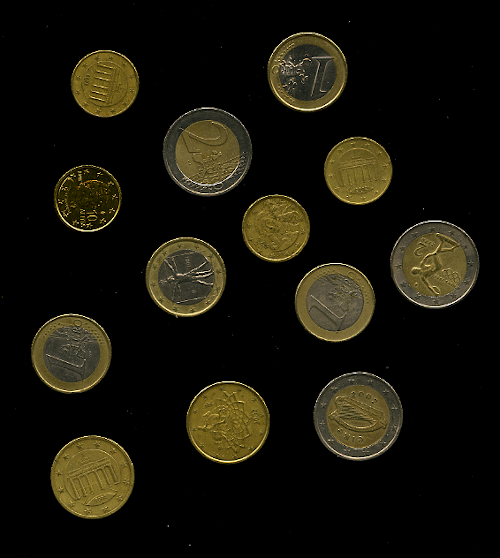
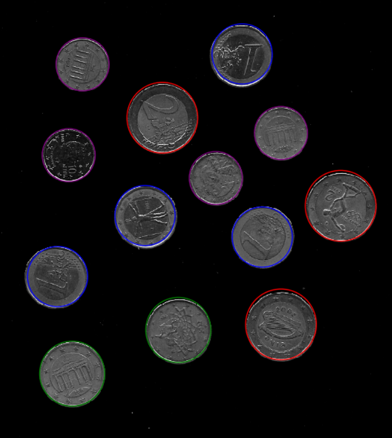

# Coin Detector
A computer vision program that detects coins in images using Hough Transform. Implemented in PyCharm as part of my 7th semester relevant course project.
  
  
## Example
Input:\

Output:\

.
